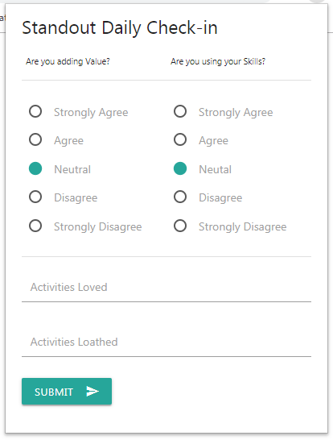

### Chrome Extension for Standout
This extension periodically prompts for a checkin during regular intervals through the day.  

In the Standout dashboard, the extension will nudge the user toward the average values inputted during the week; any loved/loathed text entered will be automatically inserted into the appropriate text fields during the check-in with a date stamp.

### Known Issues
* If Chrome is closed is during the next check-in it will automatically prompt for a checkin when Chrome is reopened.
* One of the nudges is hard to see.  

#### Screenshots

Example of the check-in page:

Example of the next check-in displayed as hover text:

Options page:

